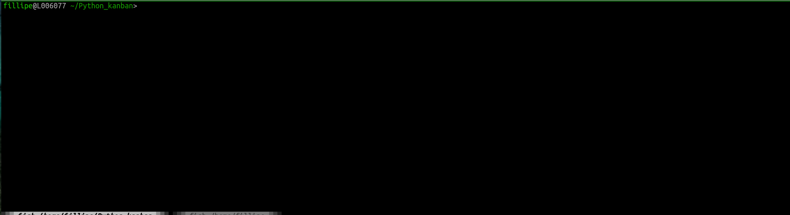

=============
Python Kanban
=============

A terminal-based interface written in pure Python for a very plain Kanban board.

Installation
============

.. code:: bash

    pip install python-kanban

Usage
=====

The simplest way to execute it is to run 

.. code:: bash

    python_kanban

in the command line. The navigation keys are (or should be) self-explanatory in the
application.

This will create a ``kanban.db`` database file in the current folder. After
quitting and running ``python_kanban`` again the same database will be loaded
and the tasks are persisted.

If you wish to customize the database file or simply manage multiple files, you
can set an environment variable with:

.. code:: bash

    export DYNACONF_DB_FILE=another_database_file.db

and it will either create another ``another_database_file.db`` file or load it
if already existing.

This is still a work in progress, the looks may be rough in the edges, but most of the main functionality is there already.

For developers
==============

The project uses `Python Poetry <https://python-poetry.org/>`_ to manage
dependencies. Check the website for installation instructions, or simply
install it with

.. code:: bash

   pip install poetry

After that, clone the repo and install dependencies with ``poetry install``.

Here are the detailed steps that should be followed before making a pull
request:

.. code:: bash

  # Autopep8 and flake8 to be conformant with PEP8
  poetry run autopep8 --recursive --aggressive --in-place .
  poetry run flake8 . --count --select=E9,F63,F7,F82 --show-source --statistics
  poetry run flake8 . --count --exit-zero --max-complexity=10 --max-line-length=79 --statistics

  # Mypy for proper type hints
  poetry run mypy --ignore-missing-imports .

Finally (and of course), make sure all tests pass and you get at least 95% of
coverage:

.. code:: bash

  poetry run pytest --cov=. --cov-report=term-missing --cov-fail-under=95 tests/

Notice there is a Github Actions continuous integration framework to test these conditions, so don't stress to much about them if you forget any step.

Release Notes and Changelog
===========================

Releases 0.2.X
--------------

Release 0.2.0
~~~~~~~~~~~~~

- Add a delete confirmation view;
- Add a category option for the todo;
- Add "ESC" shortcut to leave an "add" or "edit" view without saving.

This version is not compatible with the previous one as there was a change in the database structure. This should be the only breaking changes in the software's life cycle.

Python support: Python >= 3.7

Releases 0.1.X
--------------

Release 0.1.0
~~~~~~~~~~~~~

- Initial version. 
 
Python support: Python >= 3.7
